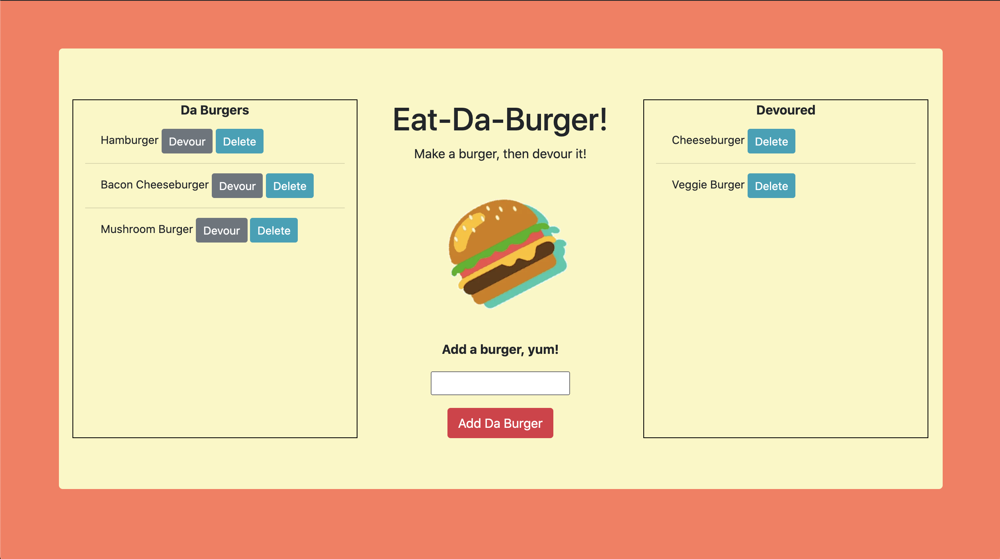

# Eat-Da-Burger

[Click me for some burger fun!] (https://salty-brook-22385.herokuapp.com/)

## Description
Eat-Da-Burger! is an application that lets users input the names of burgers they'd like to eat. It features a fun burger logger with MySQL, Node, Express, Handlebars and a homemade ORM. It follows the MVC design pattern.

## Table of Contents
- [Description](#description)
- [Installation](#installation)
- [Usage](#usage)
- [License](#license)
- [Contributing](#contributing)
- [Tests](#tests)
- [Questions](#questions)

## Installation
To use Eat-Da-Burger locally, use http://localhost:8080 after completing the following steps:
git clone 
cd burger
npm install, npm install express, npm install express-handlebars, npm install mysql`
node server.js

## Usage
Whenever a user submits a burger's name, your app will display the burger on the left side of the page waiting to be devoured. Each burger in the waiting area also has a `Devour` button and a `delete` button. When the user clicks either, the burger will move to the right side of the page.

 
## License
MIT

## Contributing
[Alexandra Hionis](https://github.com/Alexandra-Hionis/Eat-Da-Burger)

## Tests
No tests were used

## Questions
GitHub: https://github.com/Alexandra-Hionis  
Email: Alexandra.hionis@gmail.com  
